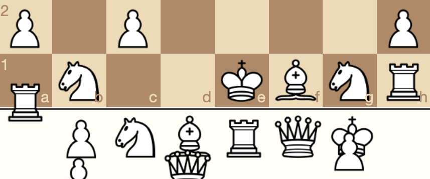

# *Let's Play: Ancient Greek Punishment: Chess Edition*

# [Play Online](https://www.pippinbarr.com/lets-play-ancient-greek-punishment-chess-edition) (desktop and mobile)

## Description
*Chess! It already feels like a punishment to so many people! But now even more so! What if Zeus threw chess sets instead of lightning bolts?! What if Archimedes was a vengeful god?! What if you just kept getting chessed for eternity?!*

_Let's Play: Ancient Greek Punishment: Chess Edition_ is yet another new edition in the _Let's Play: Ancient Greek Punishment_ series, focusing on a retelling of five (kind of) mythological punishments. In _Chess Edition_ each punishment is expressed in the language of chess!

## Press

- Nate Crowley. [Experience eternity in five minutes with Ancient Greek Punishment: Chess Edition](https://www.rockpapershotgun.com/2019/05/15/experience-eternity-in-five-minutes-with-ancient-greek-punishment-chess-edition/#comments). Rock, Paper, Shotgun. 15 May 2019.

Read the [Press kit](../press) for press information

## Documentation
* Read the [Process documentation](../process) for process journal, to do list, research questions, related work, and a closing statement
* Read the [Commit History](https://github.com/pippinbarr/lets-play-ancient-greek-punishment-chess-edition/commits/master) for step-by-step information about how the project was built
* Look at the [Code Repository](https://github.com/pippinbarr/lets-play-ancient-greek-punishment-chess-edition) for source code etc.

## License
_Let's Play: Ancient Greek Punishment: Chess Edition_ is an open source game licensed under a [Creative Commons Attribution-NonCommercial 3.0 Unported License](http://creativecommons.org/licenses/by-nc/3.0/). You can obtain the source code from its [code repository](https://github.com/pippinbarr/lets-play-ancient-greek-punishment-chess-edition) on GitHub.
