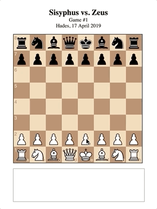
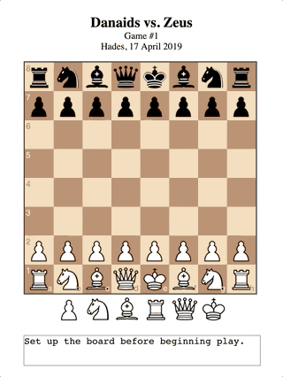

# _Let's Play: Ancient Greek Punishment: Chess Edition_ Press Kit

_Chess! It already feels like a punishment to so many people! But now even more so! What if Zeus threw chess sets instead of lightning bolts?! What if Archimedes was a vengeful god?! What if you just kept getting chessed for eternity?!_

#### [Play _Let's Play: Ancient Greek Punishment: Chess Edition_](https://pippinbarr.github.io/lets-play-ancient-greek-punishment-chess-edition)

## The basics

* Developer: [Pippin Barr](http://www.pippinbarr.com/)
* Release: 23 April 2019
* Platform: Browser (desktop and mobile)
* Code repository: https://github.com/pippinbarr/lets-play-ancient-greek-punishment-chess-edition
* Price: $0.00

## Who is this Pippin Barr guy?

Pippin is an experimental game developer who has made games about everything from [Eurovision](http://www.pippinbarr.com/2012/03/27/epic-sax-game/) to [performance art](http://www.pippinbarr.com/2011/09/14/the-artist-is-present/) to [dystopian post-work futures](http://www.pippinbarr.com/games/2017/07/03/it-is-as-if-you-were-doing-work.html). He's an Assistant Professor in the [Department of Design and Computation Arts](http://www.concordia.ca/finearts/design.html) at [Concordia University](http://www.concordia.ca/) in Montréal. He is also the director of the [Technoculture, Art, and Games (TAG)](http://tag.hexagram.ca/) Research Centre, which is part of the [Milieux Institute for Arts, Culture, and Technology](http://milieux.concordia.ca/).

## Description

_Let's Play: Ancient Greek Punishment: Chess Edition_ is the eighth edition in the _Let's Play: Ancient Greek Punishment_ series begun in 2011 and comprising: [Let's Play: Ancient Greek Punishment](http://www.pippinbarr.com/games/letsplayancientgreekpunishment/LetsPlayAncientGreekPunishment.html) (2011), [Art Edition Edition](http://www.pippinbarr.com/games/letsplayletsplayancientgreekpunishmentarteditionedition/) (2015), [Limited Edition](http://www.pippinbarr.com/games/letsplayancientgreekpunishmentlimitededition/) (2016), [CPU Edition](http://pippinbarr.github.io/letsplayancientgreekpunishmentcpuedition/) (2017), [Inversion Edition](https://pippinbarr.github.io/lets-play-ancient-greek-punishment-inversion-edition) (2019), [UI Edition](https://pippinbarr.github.io/lets-play-ancient-greek-punishment-ui-edition) (2019), and [Teaches Typing](https://pippinbarr.github.io/lets-play-ancient-greek-punishment-teaches-typing) (2019). In _Chess Edition_ the punishments are remediated as variations on classical chess.

## History

_Chess Edition_ is part of my ongoing idea of essentially spending 2019 making variations on the base _Ancient Greek Punishment_ set of minigames as a way to remain "productive" while in transition to a life with a newborn son (and later not-so-newborn son).

_Let's Play: Ancient Greek Punishment: Chess Edition_ is also another data-point in the ultra-detailed process documentation approach called [MDMA](http://www.gamesasresearch.com/mdma). So, if you want to, you can read a lot about the game's development by reading its [process documentation](https://github.com/pippinbarr/lets-play-ancient-greek-punishment-chess-edition/blob/master/process/README.md), by going through its [commit history](https://github.com/pippinbarr/lets-play-ancient-greek-punishment-chess-edition/commits/master), and by reading the [research questions](https://github.com/pippinbarr/lets-play-ancient-greek-punishment-chess-edition/blob/master/process/research-questions.md).

## Technology

_Let's Play: Ancient Greek Punishment: Chess Edition_ was created in JavaScript chiefly using [chess.js](https://github.com/jhlywa/chess.js) and [chessboard.js](https://chessboardjs.com/). I used [jQuery](http://jquery.com/) and [jQuery UI](https://jqueryui.com/) for some manipulation of elements on the page, and [MathJax](https://www.mathjax.org/) to typeset the mathematical expressions in Zeno.

## License

_Let's Play: Ancient Greek Punishment: Chess Edition_ is an open source game licensed under a [Creative Commons Attribution-NonCommercial 3.0 Unported License](http://creativecommons.org/licenses/by-nc/3.0/). You can obtain the source code from its [code repository](https://github.com/pippinbarr/lets-play-ancient-greek-punishment-chess-edition) on GitHub.

## Features

- Checkmate!
- Castling!
- En passant!
- Sicilian Dragon!
- Hopelessness!
- Why do my pieces keep falling off the board?!

### Trailer

See animated GIFs below, really.

## Images

## Press

- Coming soon?

## Additional Links

- [Process documentation of _Let's Play: Ancient Greek Punishment: Chess Edition](https://github.com/pippinbarr/lets-play-ancient-greek-punishment-chess-edition/blob/master/process/README.md)
- [Commit history of _Let's Play: Ancient Greek Punishment: Chess Edition](https://github.com/pippinbarr/lets-play-ancient-greek-punishment-chess-edition/commits/master)
- [Let's Play: Ancient Greek Punishment](http://www.pippinbarr.com/games/letsplayancientgreekpunishment/LetsPlayAncientGreekPunishment.html) (2011)
- [Let's Play: Ancient Greek Punishment: Art Edition Edition](http://www.pippinbarr.com/games/letsplayletsplayancientgreekpunishmentarteditionedition/) (2015)
- [Let's Play: Ancient Greek Punishment: Limited Edition](http://www.pippinbarr.com/games/letsplayancientgreekpunishmentlimitededition/) (2016)
- [Let's Play: Ancient Greek Punishment: CPU Edition](http://pippinbarr.github.io/letsplayancientgreekpunishmentcpuedition/) (2017)
- [Let's Play: Ancient Greek Punishment: Inversion Edition](https://pippinbarr.github.io/lets-play-ancient-greek-punishment-inversion-edition) (2019)
- [Let's Play: Ancient Greek Punishment: UI Edition](https://pippinbarr.github.io/lets-play-ancient-greek-punishment-ui-edition) (2019)
- [Let's Play: Ancient Greek Punishment: Teaches Typing](https://pippinbarr.github.io/lets-play-ancient-greek-punishment-teaches-typing) (2019)

## Credits

* Pippin Barr: basically everything?
* Rilla Khaled: design and sound consultant
* Jim and Mary Barr (aka my parents), Jonathan Lessard: testing! Thanks!

## Contact

* Email: [pippin.barr+press@gmail.com](mailto:pippin.barr+press@gmail.com)
* Website: [www.pippinbarr.com](http://www.pippinbarr.com/)
* Twitter: [@pippinbarr](https://www.twitter.com/pippinbarr)
* Instagram: [@pippinbarr](https://www.instagram.com/pippinbarr)
* Facebook: [Pippin Barr](http://www.facebook.com/pippin.barr)
