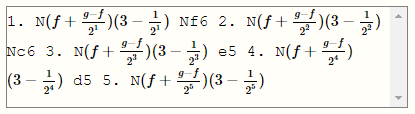

# _Let's Play: Ancient Greek Punishment: Chess Edition_ Closing Statement

(__Note__: throughout this text, I’ll be linking to process materials generated as part of the project in its [code repository](https://github.com/pippinbarr/lets-play-ancient-greek-punishment-chess-edition/blob/master/process/README.md). The links are both to the specific moments I added relevant code to the project and wrote notes about it - signified by the mysterious strings of letters and numbers known as "commit hashes" - and also to the process journal I wrote throughout design and development. This approach to process documentation is part of the [Games as Research](https://gamesasresearch.com/) project.)

[_Let's Play: Ancient Greek Punishment: Chess Edition_](https://pippinbarr.github.io/lets-play-ancient-greek-punishment-chess-edition/) is the eighth addition to a series of games based on the mythological punishments of Sisypuhs, Prometheus, Tantalus, the Danaids, and (less canonically) Zeno of Elea. In _Chess Edition_ I tried to tell these stories of punishment through the language of chess (and perhaps specifically computer chess).

As the series accumulates, it continues to serve as a way to think through specifics of design: with the core concepts (the myths) set in place, the decisions to be made can be distilled down to the design implications of a particular conceptual take ("what if _you were the boulder_ resisting Sisyphus?") or a specific form (how do I represent these ideas through the language of _chess_?). Chess is particularly satisfying in that it represents an almost platonic understanding of a "game", so translating the myths to chess feels like an ultimate game-designerly activity.

Beyond this kind of highfalutin design stuff, the project also interests me significantly at the level of the underlying technology. I'm using [chess.js](https://github.com/jhlywa/chess.js), a JavaScript chess library, and [chessboard.js](https://chessboardjs.com/), a JavaScript chessboard, and both naturally have a particular "grain" to how they do their jobs, making some things easier or more "obvious" than others. I find it nice to think about chess.js especially as manifestation of "pure chess" in code form, giving the abstract existence of chess a tangible agency in the project.

In the following, I want to focus in on each of the five sub-games in _Chess Edition_ in order to reflect on specific elements of the design trajectories followed to reach their final form. In keeping with the Games as Research project, a lot of what I'm interested in here is revealing the inner workings of design and development, the mistakes made, the decisions reconsidered, and so on.

## Sisyphus undone

Sisyphus was both the first game I envisaged in chess-form and the easiest to implement. From the beginning the idea was to allow the player to make an opening move (say "e4"), only to have the piece fall back to its original position, just as the boulder rolls back down the hill. It feels like a particularly pure representation of the myth and is aided in this computer-chess context by the traditional representation of white as the bottom of a vertical board, lending a sense of "falling back down" to the piece that wouldn't be there in other orientations.

This variation is important to me in how precisely the myth is mirrored in the underlying code using the two chess libraries. Using chess.js the code calls a `move` function to move the piece, then almost immediately called an `undo` function to put it back where it was. Thus doing and undoing is literally true at the level of code. chessboard.js is similarly cooperative in that it animates the movement of the piece and its undone movement faithfully without any intervention from me (it doesn't care about the frustrating nature of the undone move, just like the gods).

So, in the end there were few decisions or changes to make here: chess, code, and punishment were in harmony and it was only a matter of "discovering" this through the process of making.

## The apple king

In the Tantalus game I knew early on that I wanted to have the black king be off the board and thus unattainable - the myth's punishment is all about an unattainable object of desire (an apple/piece of fruit in the original) and it makes sense to me that the object of "desire" in chess is the opponent's king. However, when I tried to simply begin a chess game without the black king on the board it turned out to break chess.js, which isn't able to process legal moves in this scenario ([0a08d10](https://github.com/pippinbarr/lets-play-ancient-greek-punishment-chess-edition/commit/0a08d10ec76cd546afcdca85a014dd221adf6631)). This led to a moment of truth where I had to decide whether to do battle with the underlying chess code itself, or trying another approach, and initially I went the "easy" way by attempting a version where there were simply no black pieces on the board at all ([4452f40](https://github.com/pippinbarr/lets-play-ancient-greek-punishment-chess-edition/commit/4452f40d6b94f3bdc7c0edfdb3e4d561dc0a7527)). As I [noted in my process journal](https://github.com/pippinbarr/lets-play-ancient-greek-punishment-chess-edition/blob/master/process/process-journal.md#tantalus), though, this rang false with the myth: "philosophically this one would be suggesting that part of the point of chess is the destruction of the opposing army, which is less pure than solely thinking in terms of capturing the king."

So it became clear I needed to solve the issues around having just the black king off the board and I went ahead to edit chess.js to allow for this, eventually succeeding: Tantalus looks so much better with just the king gone. The joke is much stronger, and there's something terrible and funny about playing chess in this context, knowing  you cannot possibly win and can at best end up capturing every black piece, only to have the king perpetually out of reach" ([8168f81](https://github.com/pippinbarr/lets-play-ancient-greek-punishment-chess-edition/commit/8168f81dbc5966b5b86843a46c6c6c90052e9fdd)). Having solved the core technical problem, it remained to tune the comedy of the kingless board by having the black king "step off" after white's first move ([eda45d2](https://github.com/pippinbarr/lets-play-ancient-greek-punishment-chess-edition/commit/eda45d2eed90bfbef7d20695f4a860a91b8b4014)), though on reflection I clearly missed the opportunity to also register this stepping off as officially black's "opening" in the game, complete with notation (`1. e4 Ke9` perhaps, or even `1. e4 K??`).

## What's the right game-feel for having your liver pecked out?

The key design question for the Prometheus version was about "feel": in the original game, it was the sense of helplessness and passivity for the player that I found especially resonant and interesting as an experience, and I felt I needed to recreate that in the metaphorical chess version. I began by reducing white's piece down to just the king, to create that idea of solitary misery - the king can move around the board before eventually being checkmated by black due to its weakness, though as I noted in the commit message I was very concerned by the fact that black would often stalemate white, which didn't feel appropriately punitive ([ec8423d](https://github.com/pippinbarr/lets-play-ancient-greek-punishment-chess-edition/commit/ec8423da8b8bbd0521dba2c1e412822c7e48f6f5)). The core idea was that white needed to move around on the board to recreate the basic sense of "struggling" that is present in the myth and the original game.

Eventually, however, even being able to move on the board felt like a degree of freedom too far, and I chose to step away from official chess rules once more in order to have a king that simply could not move. That is, you could select a legal square adjacent to the king, but on selecting it the king would only jiggle in place as if struggling against invisible chains. Black would then complete its own move and the cycle would continue. In this version I further modified the rules to consider any check of the white king as _checkmate_ given that the king could not move or protect itself ([2110d10](https://github.com/pippinbarr/lets-play-ancient-greek-punishment-chess-edition/commit/2110d10d54966eb9cbd5a4f77f988f3ee4c44064)).

I was completely happy with this version, but my colleague [Jonathan Lessard](https://jonathanlessard.net/) expressed after playtesting that he missed the visceral idea of pecking and suggested adopting a technique we'd been using for a version of our game [Chogue](https://www.pippinbarr.com/games/2018/07/12/chogue.html) (subsequently released as [Rogess](https://github.com/pippinbarr/rogess)) in which pieces effectively "peck" each other, swooping in to do damage and then returning to their original position. Interestingly, this echoed [suggestions I'd heard from the students in my programming class](https://github.com/pippinbarr/lets-play-ancient-greek-punishment-chess-edition/blob/master/process/process-journal.md#prometheus-bound) that "swooping" pieces might better evoke the sense of an eagle. It's important to listen to strong feedback, and I [implemented this more overt pecking version](https://github.com/pippinbarr/lets-play-ancient-greek-punishment-chess-edition/blob/master/process/process-journal.md#feeling-peckish) right away (https://github.com/pippinbarr/lets-play-ancient-greek-punishment-chess-edition/commit/fe2c3d07ee057d789982ab99eccf03c6e17edffc).

## Chess as water

The Danaids level of the game is a good example of needing to totally rethink a design based on feedback, leading to what I think is a far superior and more interesting interpretation of the myth. The core of myth is expressing the idea of trying to work with water that is always flowing away before you can finish your job, so the initial idea was that whenever white captured a black piece, the piece would simply respawn on the board, thus "slipping through white's grasp like water" ([f68112a](https://github.com/pippinbarr/lets-play-ancient-greek-punishment-chess-edition/commit/f68112a96ac832d648e08504ad4cdedadaced554)). Even in my [earliest thinking about this in the process journal](https://github.com/pippinbarr/lets-play-ancient-greek-punishment-chess-edition/blob/master/process/process-journal.md#danaids), it was clear that I had serious doubts: "There's a slight lack of clarity in terms of how to represent this happening... How clear will it be to a player what is happening?" I soothed myself somewhat through the amusement of also making the king able to "teleport" out of checkmate to avoid white winning ([cc1baea](https://github.com/pippinbarr/lets-play-ancient-greek-punishment-chess-edition/commit/cc1baea23279a62c229be3831f723fea744c2623)), but in the end it was obvious during testing that this was a deeply opaque representation of the myth and I needed to rethink.

After some thought it seemed obvious that the right way to go about things was for pieces to fall off the board, dripping like water. Initially, I thought this would happen at the beginning: white's pieces would drip from the board and after that they would be incapable of playing. However, that approach negated the infinite, cyclical nature of the punishment myths. Instead, I went with a part of "playing chess" that might or might not be considered actually part of the game: setting up the board ([c356883](https://github.com/pippinbarr/lets-play-ancient-greek-punishment-chess-edition/commit/c35688324f98b3b8d693e84a47b88113ef58795b)). In the final version your pieces drip off the board, but you are able to then attempt to set the board up again in order to be able to play (only to have those pieces also drips off, etc., creating the desired infinite loop). As I note in the process journal, [this is satisfying on multiple fronts](https://github.com/pippinbarr/lets-play-ancient-greek-punishment-chess-edition/blob/master/process/process-journal.md#danaids-overhaul): it gives Danaids its own unique "visual signature", distinguishing it from the other versions; it is pleasingly literal in its representation of the flow of "water"; it incorporates a wider understanding of what it means to play chess by including setup; and it couples tightly with how digital chessboards often function, with a row of "spare" pieces along the bottom that you use to create board positions to investigate (though in the end I implemented by own version of this rather than using chessboard.js's built-in support).

Danaids is thus a great illustration of how important it is to pursue the "right" version of your idea, rather than settling for an idea that works but is perhaps not completely true to the spirit of your work. If I'd settled for the "respawning" pieces, it would have been fine, but I would have missed a much more integrated and satisfying representation of the underlying myth. Note how much this was helped along both by acknowledging my own doubts in the documentation, having those doubts confirmed through testing, and then being willing to do the extra work to go back to the drawing board.

## Algebraic paradox notation

Zeno was straightforward to design in terms of the chessboard itself - as with past iterations of the punishment series, it would entail that in making a "move" in the chess game the piece would first need to move halfway to the destination square, then halfway again, and so on - the punishment here being that each "half-move" white makes is responded to by a normal move from black ([b20bfa0](https://github.com/pippinbarr/lets-play-ancient-greek-punishment-chess-edition/commit/b20bfa0ab6d32a7a0de3642c2b528fd9178b0fd7)). (As a side note, [it was this Zeno version that forced me to using click-based play](https://github.com/pippinbarr/lets-play-ancient-greek-punishment-chess-edition/blob/master/process/process-journal.md#chess--ai-implemented-on-with-the-specifics-wednesday-3-april-2019-1654pm) rather than dragging, since this would be the only way to enforce my own rules on moving through space ([df0bc89](https://github.com/pippinbarr/lets-play-ancient-greek-punishment-chess-edition/commit/df0bc89c8bfba4027d7ee5e44a4b374282ba89fc)).)

On getting the movement working, though, I realised that the true design problem was the notation: chess games are traditionally documented in PGN notation, but the Zeno version contained impossible moves that don't fit within this, with moves that take half a square for instance. This can be solved for the vertical component (along files) because those are numbered and those numbered can be fractional (e.g. if white plays `e4` they actually see `1. e3 ... 2. e3.5 ... 3. e3.75` and so on). For the ranks, which are represented by letters, it's not as simple ([7c18f8d](https://github.com/pippinbarr/lets-play-ancient-greek-punishment-chess-edition/commit/7c18f8db0161d18b086751a915a3d7dd2eeb04c9)). Fortunately, I was able to solve the problem by noting that chess notation is often referred to as _algebraic notation_, pointing to the idea that [it's a form of algebra](https://github.com/pippinbarr/lets-play-ancient-greek-punishment-chess-edition/blob/master/process/process-journal.md#the-pgn-of-zeno), and that one can of course perform the kinds of mathematical operations in algebra that you would need. Even more satisfyingly, I further realized that one retort to Zeno's paradox is Archimedes's suggestion that it is solved using [geometric series](https://en.wikipedia.org/wiki/Geometric_series). This gave me a specific mathematical format with which to express each individual move:

In the end, I think Zeno is especially fun because Zeno's punishment is emphasised through the disparity between his eternal half-moves and black's regular moves, suggesting that Zeno is _wrong_, but must still play by his own rules. To sharpen the blow, Zeno's listed opponent is Archimedes and the representation of Zeno's moves is in the form of geometric series, but without the vital summing to infinity that would solve the paradox! Take that Zeno!

## Checkmate! Play again!

That brings us to the end of this discussion, and I hope I've illustrated some of the complexity and murkiness that goes on behind the scenes of even a series of tiny little games with big design dreams. I hope, too, that this goes some way toward showing the value of an intensive documentation process during design and development. Without the fairly comprehensive work I did to document this game, there's no way I'd have been able to unpack all this, nor support it with specific evidence from the development process itself.

_Let's Play: Ancient Greek Punishment: Chess Edition_ was a very satisfying project, with many neat design moments, insightful testers, and generative frustrations. The "conversation" with chess.js and chessboard.js remains a highlight, with interesting give and take between the "correct" representations of chess and my diversions from them. Chess is a surprisingly "flexible" in terms of its expressiveness, and that in combination with the highly metaphorical nature of the myths themselves has led to a worthwhile hybrid. Ultimately, I think game design and development is a way of thinking about particular ideas and then somehow making that thought process available in the game itself. Thanks for _checking_ this out.
