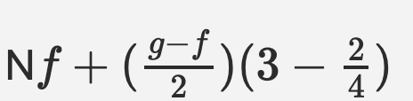
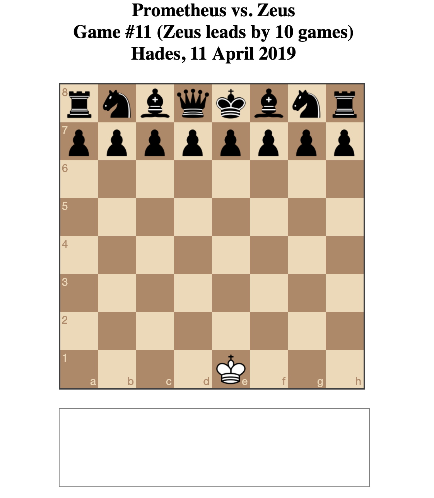

# Things notes (Saturday, 16 March 2019)

piece falls back at opening; opposing king is off the board; piece moves halfway over and over; you can’t move and king is captured over and over: danaids?

# Notebook images (Tuesday, 2 April 2019)

# Opening (ha ha) (Wednesday, 3 April 2019, 10:45AM)

Okay it's a new day it's a new dawn it's a new life it's a new ancient greek punishment game.

The thought here is to more fully remediate the original game as with UI edition by really switching to a totally new format (rather than a new input system or form of agency for instance). So here the idea is to represent all the punishments in the language of chess. Feels kind of ambitious, but I do have ideas for how to do it, and I suspect that both chess and the myths are "universal" enough that it ought to be at least somewhat possible. And anyway, the fun is in the process and then maybe MAYBE in the game.

Without further ado, here are my current thoughts on what to do...

## Sisyphus

Player is white. Any move they place subsides back to where it started so it's impossible to actually play  a move. Pawns slide back, knights slide back. That's the whole thing. Black never plays because white's move never sticks. And scene.

A different version (this will apply to more than one of these) would be that white's moves slide back but black plays on. I feel like that's a somewhat different idea though (more in keeping with Prometheus since you're literally being attacked while powerless to resist). So I suspect the totally passive version is best - and kind of punchier.

## Prometheus

Player is white (or black?) and can't make any moves at all. Meanwhile the opponent plays normally, making moves and presumably ultimately defeating white.

Variation: as above, but white only has their king which they cannot move.

Variation: white only has their king but can move it around (equivalent to the "struggling" in the original game in this case). Question: would the simple AI I envisage implementing be able to defeat white in these scenario?

## Tantalus

Player is white. Play proceeds normally but black's king just isn't on the board and so can never be checkmated, always out of reach. Perhaps more in keeping with the idea of the king as the "apple" you're trying to reach, but never reaching.

Variation: all of black's pieces are off the board so white is stuck playing their pieces meaningless on an empty board, unable to reach their opponent. Philosophically this one would be suggesting that part of the point of chess is the destruction of the opposing army, which is less pure than solely thinking in terms of capturing the king?

## Zeno

Have been struggling with how to represent this one in a nice way. Thinking it may be plausible do it in chess notation? To some degree. So if you were to play e2e4 it would first play e2e3, then e3e3.5, then e3.5e3.75, and so on. A problem with this being the 53 (or so) move limit before you run out of floating point precision.

However, then the question would be: can the black AI defeat white unopposed in 53 moves? This would be a variation where black plays once per white's sub-moves. Weird-ish in that black then isn't subject to the same paradox, but that's also funny because it suggests white is Zeno and is punished for their stupid believes about the impossibility of complete motion.  53 moves unopposed seems like it should win? And if so then wouldn't actually need to worry about float point precision. Would have to test it out.

## Danaids

This struck me as the hardest one because the original is the most involved of the myths mechanically (at least the way I represented it in the game, with the different stages of activity). However, if we just thinking about it as a situation where the substance you're "collecting" (water) continuously runs out of its container (the bath), then one conceptualisation here would be that each piece you capture of black's reappears on the board... i.e. flows out of wherever dead pieces are kept, back to its starting point.

There's a slight lack of clarity in terms of how to represent this happening. And also the question of where the piece would reappear. Where it was captured? Where it was originally from? A random free square? A random square near its spawn point? How to handle collections? How clear will it be to a player what is happening?

## And now?

First task is just to implement chess and the chess AI from [Lauri Hartikka](https://medium.freecodecamp.org/simple-chess-ai-step-by-step-1d55a9266977) to prove to myself I can interface with the two main libraries chess.js and chessboard.js (I used them for Best Chess). Then the big question will probably be just how hackable the process and representation of chess is in these libraries. The true horror would be having to actually implement a real chess representation of my own. That might be horrifying enough for me to back slowly away.

Let's see!

---

# Chess + AI implemented, on with the specifics (Wednesday, 3 April 2019, 16:54PM)

This morning and this afternoon I've managed to get chess.js and chessboard.js working properly, as well as implementing a basic click-to-move setup rather than dragging (to avoid trouble with Zeno specifically). Also implemented the AI from that tutorial, got a version working where you can play white against the AI (it's not terrible, it's good enough that you can't just fuck around), and then got a version working where white can't move and black just plays on and on - because I was interested for Prometheus and Zeno as to whether black can win unopposed. It can. In 8 moves.

Actually slightly more efficient than I'd like? Is there some way to get a bit of variance in its moves? Otherwise it's going to look like a canned attack.

So that being the case, I have actual tasks ahead of me to implement the real games...

## Sisyphus

The easiest one. Just need to revert the move (including animation... argh) after it is played, then play black's move. And on we go. As we know, black can win this in 8 moves. Will have to think about the issue of a Sisyphean move that involves a capture (need to undo the capture). I know the game system has an undo, so it's possible I just display the board, undo, and redisplay, and it'll take care of animations for me.

## Prometheus

There's a decision to be made here about what white's situation is. In particular I already have the version where white is totally passive working (it's the build associated with this current journal entry in fact). But I'm wondering if we're just going to see that too often (Zeno involves unopposed victory for black, so does Sisyphus). For the sake of variety I might make it a white king against the full black set of pieces so you can "struggle" against it, while ultimately losing.

## Zeno

This one will need to fake white's moves. As soon as they make their first move we animate halfway. But that animation should likely be jQuery rather than the board, we should just remove the piece altogether? (Unless it actually ends up on a valid square? For instance e2e4 starts with e3... that's awkward... although black won't be in a position to attack that square by then and after that it'll be too late). Then black continues to play. And we need to "hack" the PGN display so that we see the fractional moves white is making. Other than that it's a black victory unopposed, which would lead to the same 8 move checkmate as above with Sisyphus and Prometheus.

## Tantalus

Can just set the board without Black's king (hoping it doesn't break the game engine's analysis stuff...). And then display the king just off the square so that you see it. Again this would likely just be jQuery displaying it in the right place (one tile's worth of y above the king's regular square).

## Danaids

I haven't completely settled how the respawning works or if that's the right thing. But the point for now is restoring captured piece. I imagine it should be immediate, so you'd capture, there would be a beat, and then the piece would reappear... somewhere. The where is a bit tricky. Current best guess is as near as possible to it's point of origin, but I'm not sure how easy that would be to track? Guess it could be added to the data for each piece?

This reminds me that SFX would make a difference. Maybe even just steal the Chogue ones, which are nice. And a reverse capture sound for the restoration of pieces would be funny.

## Structure

Okay, so I kind of feel like there's nothing too overwhelming lurking in there (pending some sort of disaster I just can't perceive lying in wait).

However there's the question of how to structure the code so this doesn't turn into horrible spaghetti bullshit. Buuuut there's also the whole idea of "just hack that shit together" instead. Buuuut I could also create a class representing a basic game of chess and then extend and override the parts needed to create my  versions, which would be significantly cleaner.

I guess I lean toward a bit of structure. Okay fine. Fine. Yeah fine. Okay fine. Sure. Okay fine sure okay  fine yeah okay.

---

# Some decisions (Thursday, 4 April 2019, 9:33AM)

Having run the variations past Rilla last night (or was it this morning? Who can tell?) I want to record the directions I'll go in for each version quickly...

__Sisyphus__ will be as is, you move your piece, it slides back, no move is registered, you never get past the initial attempt to move.

__Prometheus__ will be the white king versus the full black set of pieces, you move the king around to "struggle" but ultimately must succumb presumably (will need to make sure black can win, but I'd be surprised if it couldn't)

In __Zeno__ you move, the piece slides halfway, back moves, halfway again, and so forth.

In __Tantalus__ the black king is off the board, you play as normal, you can't win because you can't attack the king.

In __Danaids__ every capture results in the captured piece reappearing on or near its original square, and that's it.

So on with the show right?

---

# Basic feature complete, further design thoughts (Monday, 8 April 2019, 12:11PM)

Not totally sure what I specifically since the last entry but I guess it's all in the commits. Importantly all the versions now have some kind of approximate, playable edition. Importantly, all of them are pretty much there conceptually, I think with the exception of Zeno which isn't feeling so good at the moment in many ways.

A couple of thoughts

- There's something mildly disappointing about handling check-mate? Unless maybe each one is pitched as "you just need to win one game to be released from Hades?" - a bit like the whole idea that you play chess with death to escape the underworld? (As in, Bill and Ted's Bogus Journey?) That might make the framing more satisfying. Can I guarantee no wins for white? (Sisyphus √ Prometheus √ Tantalus √ Zeno √ Danaids... hm. Only if I implement the idea that you capture the king only to have it respawn? Ha ha? It would be VERY hard to win given you can't capture any pieces? So hard I don't worry?)

- Keeping a score counter would be funny. And the PGN can have 'White (Sisyphus vs. Black (Zeus) or whatever???)' Ya h a h a.

- I definitely find myself worrying about whether this whole thing is just too chess? Like this is pretty inside baseball (chess) stuff that might be deeply, deeply unappealing to 99% of people? But on the other hand how much should I give a shit? 0% you say? Oh ok.

- Suspect each game probably needs a little intro to set the scene. Just that you need to win the game, who its against, what your crime was.

- Maybe the menu can be framed in terms of matches?
   - Sisyphus vs. Zeus
   - Prometheus vs. Zeus
   - Danaids vs. xxx etc...
   - That's quite nice.

- Okay that's some nice framing that makes me feel like the menu system will look less god awful.

Next steps?

- PGN
- Fix broken shit
- Mobile?
- Menu system
- la la

---

# The GIF of Sisyphus, The PGN of Zeno, The checkmating of Zeno, Danaids and black in checkmate (Monday, 8 April 2019, 15:59PM)

Made more progress and things are starting to hang together with bits and pieces of more serious problems. Most notably Zeno is causing trouble!

## The GIF of Sisyphus

Oh but for right now look it's a GIF of Sisyphus

The GIF of Sisyphus. Ha ha.

Anyway, Zeno.

## The PGN of Zeno

So I realised a further problem while trying to implement the PGN - or rather just think about it - is that when you play a knight move it moves horizontally between columns which would mean needing to talk about fractional columns which... didn't make sense. But then I've been thinking maybe by using the algebraic look of the chess notation, we could do something like

Which is kind weird to look at, but would specify the first move of Nf3 as played by Zeno? That is, it's a move from f + the difference between g and f (one column) over two (to get halfway between f and g) and then the vertical component is what you'd expect - the destination minus half the distance remaining. Expressed as a formula there's something a little bit appealing about it I think? And it makes sense that this is roughly how it would look?

Anyway I think this at least allows me to push forward with it.

## The checkmating of Zeno

The other problem with Zeno is that you can be kind of both in and not in checkmate. As in, you're not in checkmate according to the game because you could move the king or shield it, but because of the Zeno-ing of your initial move, in fact you can't defend yourself because that move isn't done, and so you are in a kind of checkmate.

So how should black respond? I can either call the game off at that point, notating it as checkmate by throwing the hash onto it officially. It's checkmate because the king is in check, cannot move, and cannot be shielded.

OR I allow black to capture the king. As I think about it, I'd rather avoid this avenue? It seems wrong to show the king being captured.

## Danaids and black in checkmate

Though this also speaks to Danaids, in which I don't really want the Danaid to checkmate black (doesn't make sense to win), and so one funny response is you get checkmate, capture the king, and on you go? But then that's the same weirdness.

Perhaps when you checkmate the king is just moves to another square elsewhere (not in check obviously), similarly sliding through your fingers like water. I think I could live with that...

---

# "Finished" (Monday, 15 April 2019, 11:07AM)

At this point I think the game is basically completed with maybe just some styling issues left to consider (and also to consider whether I want to consider stupid stuff like people resizing the page while playing which... nah... and people going into landscape while playing which... nah...)

I really haven't done a great job of keeping this process journal updated while making the game, in part because I feel like the design process has kind of rushed along and I had insights into what to do while writing commit messages or even writing out to-dos. The point where there hasn't been the same need to sit back and think quite so philosophically about how the game should feel.

As such, let me at least review a few key decisions that got made.

## Displaying the number of games played

I became a bit dissatisfied with the game headers at some point because they weren't really reflective of the idea of ongoing punishment in the versions where multiple games would be played (e.g. white getting checkmated and the game restarting). So I wanted to include some indication of the history of play. Took a while to feel like I had the right idea, but I do like the mean emphasis on how many games Zeus is winning by in each case (or Archimedes for Zeno), it's so pointed and depressing. I also made Zeus win in the case of stalemate which amuses me too. Basically if the game ends, white loses, because they can't ever checkmate black (it's impossible in all forms especially now that Danaids is different).

## Danaids overhaul

After sending the game out to testers (though I only really heard back from Jim), I had my suspicions that Danaids was unclear confirmed and ended up feeling like I needed to rework it. Originally the idea was that every captured black piece would "slip through your fingers like water" and go back onto the board. I think the metaphor is pretty sound, but when you're playing it just feels like a comically unfair game of chess, which is good but not great. So I went back into it trying to think about water and went with the idea of the _white_ pieces being the water, so when you start they all pour off the board and in fact the "gameplay" is you trying to get your pieces set up properly while they continuously pour away.

I like this for a lot of reasons
- It's visually interesting in a different way to the other games (each one has its own kind of visual/animated signature which adds to the feeling of variety)
- It genuinely captures the idea of water pouring out of a container and so strongly evokes the original myth in a clear way, rather than in a metaphorical way (I mean, it's still a metaphor, but a much more direct implementation of the entailments?)
- It allows playing with another part of chess that I hadn't been thinking about, which is setup. This speaks the broader question of what it means to play chess - is setting the board up part of the game? I think it's possible to answer that with a yes, or at the very least to say that the larger social practice of chess includes that
- It engages with that part of chess specifically as represented in digital chessboards - chessboard.js even has the specific ability to display "spare pieces" which you can drag into play to set up scenarios. In the end I couldn't use it because I needed a lot more control over how the pieces behaved, but it's nice to feel like there's a hook at the technical level

## Prometheus Bound

I originally implemented Prometheus to have a lone king that would be able to move around, opposed by the entire black army. One problem I ran into was stalemate, so I try to make the black AI allergic to stalemate, which largely work (though this is kind of superceded by stalemate being a black victory).

I'd visualised the white moves as "struggles", but when you play it, it looks like too much freedom and doesn't convey the idea of being bound properly. So instead I went with a version where every white move is just the king struggling in his bounds and staying on the same square, completely with PGN reflecting it.

I should also mention that I had a conversation with students about this one (in the prior version where the white king could move) and they said a couple of interesting things about the specific metaphor of the eagle, suggesting that maybe it should be queens or bishops "swooping" in at the king to attack it in order to preserve that specific idea. I like that kind of thinking, and it reflects a larger design question about how specifically you want to represent the nature of myth and the whole distinction between "in spirit" and more literally interpretations. Ultimately I guess a satisfying design is going to walk the line with it, and the "satisfying" bit will just need to be the satisfaction of the designer?

## Checkmates

As in the previous post, I spent time fretting about checkmate in both directions. Notably you don't want white to checkmate black (it's meant to be a more futile experience than that!)

- Sisyphus never begins so no problem there
- Prometheus can't move so that similarly no problem
- Tantalus has no black king on the board to it can't be checkmated
- Zeno effectively "can't move" so again no problem
- Danaids also never begins now (it used to be a concern as I wondered whether it might have been possible to checkmate black with amazing play, but even then I ended up implementing the idea that the black king would just teleport out of check)

Similarly, I need black to be able to checkmate white through standard play (since the AI needs to accomplish it!)

- Sisyphus never begins, so no problem
- Danaids never begins, so no problem
- Prometheus can't move so I made it that any check is effectively checkmate
- Zeno is similar to the above, any check it effectively checkmate
- Tantalus plays normally, so black can checkmate white for sure - the game could also end in stalemate, in which case black also wins

So this key question of how to handle game-ending stuff is pretty well handle I guess?

## And now?

Well I think it's kind of done, eh. There's definitely more I could do to make it slicker, but like everything I do it's pretty much conceptual with aesthetics being advanced far enough to support the idea and no further? In which case press kit etc. and release... Friday? Next week Wednesday? Tuesday? Bleagh?

Actually just quietly went and tweaked the CSS a tiny bit and it looks nicer. And then fixed underline color on iOS (needed webkit version). And then fixed weird scrolling issue on iOS (wrapper height set to 100% and overflow hidden). And then ran into stuff with the pieces falling in Danaids causing ability to scroll. And then fighting against this. And then giving up. And this is why we despite mobile versions of our non-pure-canvas games, kids. Sheesh.
