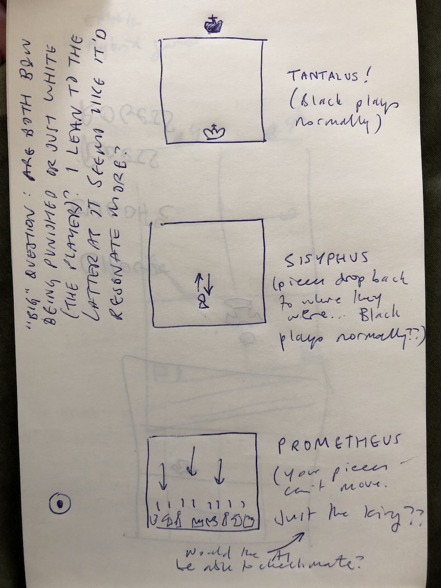
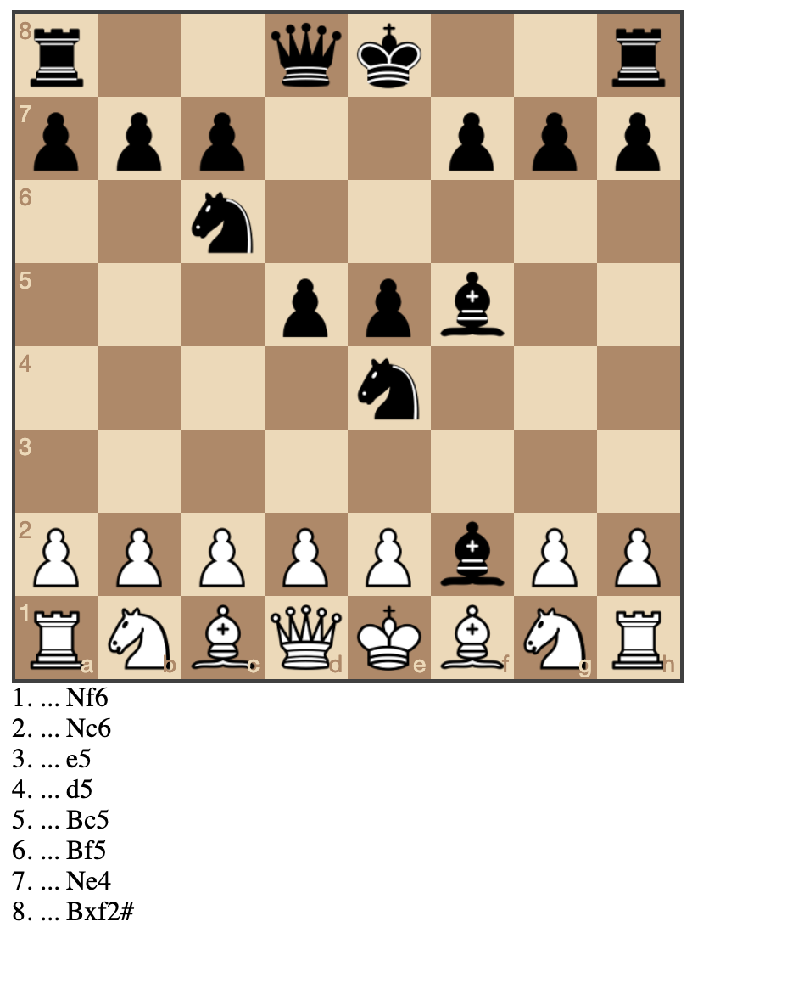

# Things notes (Saturday, 16 March 2019)

piece falls back at opening; opposing king is off the board; piece moves halfway over and over; you can’t move and king is captured over and over: danaids?

# Notebook images (Tuesday, 2 April 2019)

# Opening (ha ha) (Wednesday, 3 April 2019, 10:45AM)

Okay it's a new day it's a new dawn it's a new life it's a new ancient greek punishment game.

The thought here is to more fully remediate the original game as with UI edition by really switching to a totally new format (rather than a new input system or form of agency for instance). So here the idea is to represent all the punishments in the language of chess. Feels kind of ambitious, but I do have ideas for how to do it, and I suspect that both chess and the myths are "universal" enough that it ought to be at least somewhat possible. And anyway, the fun is in the process and then maybe MAYBE in the game.

Without further ado, here are my current thoughts on what to do...

## Sisyphus

Player is white. Any move they place subsides back to where it started so it's impossible to actually play  a move. Pawns slide back, knights slide back. That's the whole thing. Black never plays because white's move never sticks. And scene.

A different version (this will apply to more than one of these) would be that white's moves slide back but black plays on. I feel like that's a somewhat different idea though (more in keeping with Prometheus since you're literally being attacked while powerless to resist). So I suspect the totally passive version is best - and kind of punchier.

## Prometheus

Player is white (or black?) and can't make any moves at all. Meanwhile the opponent plays normally, making moves and presumably ultimately defeating white.

Variation: as above, but white only has their king which they cannot move.

Variation: white only has their king but can move it around (equivalent to the "struggling" in the original game in this case). Question: would the simple AI I envisage implementing be able to defeat white in these scenario?

## Tantalus

Player is white. Play proceeds normally but black's king just isn't on the board and so can never be checkmated, always out of reach. Perhaps more in keeping with the idea of the king as the "apple" you're trying to reach, but never reaching.

Variation: all of black's pieces are off the board so white is stuck playing their pieces meaningless on an empty board, unable to reach their opponent. Philosophically this one would be suggesting that part of the point of chess is the destruction of the opposing army, which is less pure than solely thinking in terms of capturing the king?

## Zeno

Have been struggling with how to represent this one in a nice way. Thinking it may be plausible do it in chess notation? To some degree. So if you were to play e2e4 it would first play e2e3, then e3e3.5, then e3.5e3.75, and so on. A problem with this being the 53 (or so) move limit before you run out of floating point precision.

However, then the question would be: can the black AI defeat white unopposed in 53 moves? This would be a variation where black plays once per white's sub-moves. Weird-ish in that black then isn't subject to the same paradox, but that's also funny because it suggests white is Zeno and is punished for their stupid believes about the impossibility of complete motion.  53 moves unopposed seems like it should win? And if so then wouldn't actually need to worry about float point precision. Would have to test it out.

## Danaids

This struck me as the hardest one because the original is the most involved of the myths mechanically (at least the way I represented it in the game, with the different stages of activity). However, if we just thinking about it as a situation where the substance you're "collecting" (water) continuously runs out of its container (the bath), then one conceptualisation here would be that each piece you capture of black's reappears on the board... i.e. flows out of wherever dead pieces are kept, back to its starting point.

There's a slight lack of clarity in terms of how to represent this happening. And also the question of where the piece would reappear. Where it was captured? Where it was originally from? A random free square? A random square near its spawn point? How to handle collections? How clear will it be to a player what is happening?

## And now?

First task is just to implement chess and the chess AI from [Lauri Hartikka](https://medium.freecodecamp.org/simple-chess-ai-step-by-step-1d55a9266977) to prove to myself I can interface with the two main libraries chess.js and chessboard.js (I used them for Best Chess). Then the big question will probably be just how hackable the process and representation of chess is in these libraries. The true horror would be having to actually implement a real chess representation of my own. That might be horrifying enough for me to back slowly away.

Let's see!

---

# Chess + AI implemented, on with the specifics (Wednesday, 3 April 2019, 16:54PM)

This morning and this afternoon I've managed to get chess.js and chessboard.js working properly, as well as implementing a basic click-to-move setup rather than dragging (to avoid trouble with Zeno specifically). Also implemented the AI from that tutorial, got a version working where you can play white against the AI (it's not terrible, it's good enough that you can't just fuck around), and then got a version working where white can't move and black just plays on and on - because I was interested for Prometheus and Zeno as to whether black can win unopposed. It can. In 8 moves.

Actually slightly more efficient than I'd like? Is there some way to get a bit of variance in its moves? Otherwise it's going to look like a canned attack.

So that being the case, I have actual tasks ahead of me to implement the real games...

## Sisyphus

The easiest one. Just need to revert the move (including animation... argh) after it is played, then play black's move. And on we go. As we know, black can win this in 8 moves. Will have to think about the issue of a Sisyphean move that involves a capture (need to undo the capture). I know the game system has an undo, so it's possible I just display the board, undo, and redisplay, and it'll take care of animations for me.

## Prometheus

There's a decision to be made here about what white's situation is. In particular I already have the version where white is totally passive working (it's the build associated with this current journal entry in fact). But I'm wondering if we're just going to see that too often (Zeno involves unopposed victory for black, so does Sisyphus). For the sake of variety I might make it a white king against the full black set of pieces so you can "struggle" against it, while ultimately losing.

## Zeno

This one will need to fake white's moves. As soon as they make their first move we animate halfway. But that animation should likely be jQuery rather than the board, we should just remove the piece altogether? (Unless it actually ends up on a valid square? For instance e2e4 starts with e3... that's awkward... although black won't be in a position to attack that square by then and after that it'll be too late). Then black continues to play. And we need to "hack" the PGN display so that we see the fractional moves white is making. Other than that it's a black victory unopposed, which would lead to the same 8 move checkmate as above with Sisyphus and Prometheus.

## Tantalus

Can just set the board without Black's king (hoping it doesn't break the game engine's analysis stuff...). And then display the king just off the square so that you see it. Again this would likely just be jQuery displaying it in the right place (one tile's worth of y above the king's regular square).

## Danaids

I haven't completely settled how the respawning works or if that's the right thing. But the point for now is restoring captured piece. I imagine it should be immediate, so you'd capture, there would be a beat, and then the piece would reappear... somewhere. The where is a bit tricky. Current best guess is as near as possible to it's point of origin, but I'm not sure how easy that would be to track? Guess it could be added to the data for each piece?

This reminds me that SFX would make a difference. Maybe even just steal the Chogue ones, which are nice. And a reverse capture sound for the restoration of pieces would be funny.

## Structure

Okay, so I kind of feel like there's nothing too overwhelming lurking in there (pending some sort of disaster I just can't perceive lying in wait).

However there's the question of how to structure the code so this doesn't turn into horrible spaghetti bullshit. Buuuut there's also the whole idea of "just hack that shit together" instead. Buuuut I could also create a class representing a basic game of chess and then extend and override the parts needed to create my  versions, which would be significantly cleaner.

I guess I lean toward a bit of structure. Okay fine. Fine. Yeah fine. Okay fine. Sure. Okay fine sure okay  fine yeah okay.
